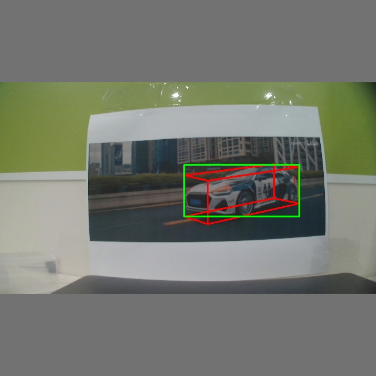
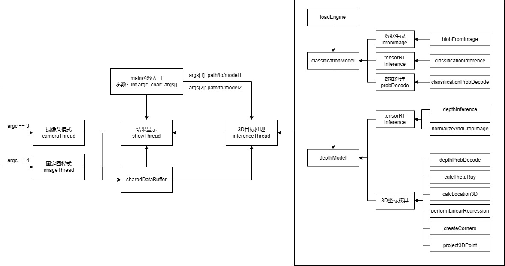

# nVidia Jetson NX Xavier Mono3D Detection

## 算法基础说明
* python版本的算法设计可以参考：[ruhyadi/YOLO3D](https://github.com/ruhyadi/YOLO3D)
* 考虑到目前只需要对 *Car* 类型进行检测，在C++算法设计过程中对计算过程进行优化
* 交叉编译链为[gcc-linaro-7.5.0-2019.12-x86_64_aarch64-linux-gnu](https://releases.linaro.org/components/toolchain/binaries/latest-7/aarch64-linux-gnu/gcc-linaro-7.5.0-2019.12-x86_64_aarch64-linux-gnu.tar.xz)
* jetpack版本：4.6-b197
  ```bash
  sudo apt-cache show nvidia-jetpack
  ```
* 


## 文件结构说明

```bash
.
├── 3rdparty
│   ├── cuda
│   ├── logc
│   ├── opencv
│   └── tensorrt
├── images
├── include
│   ├── bbox_queue.h
│   ├── inner_config.h
│   ├── tensorrt_logging.h
│   ├── infer_math.h
│   ├── infer_utils.h
│   └── utils.h
├── libs
├── models
│   ├── classificationModel.engine
│   └── depthModel.engine
├── scripts
│   ├── config.txt
│   ├── countCodeLine.sh
│   ├── quickmake.sh
│   ├── download.sh
│   └── upload.sh
├── src
│   ├── infer_utils.cpp
│   └── infer_math.cpp
├── tools
│   ├── export.py
│   └── mem_monitor.cpp
├── CMakeLists.txt
└── main.cpp
```

### 3rdparty

* 该文件夹下面包含了程序编译过程中需要用到的第三方库
* cuda/tensorrt是从Xavier板上取下来的，保证版本一致
* 使用到的第三方库有cuda, logc, opencv, ffmpeg, tensorrt，需要自己编译一下opencv和ffmpeg，logc源码提供
* ffmpeg是用于实现视频推流检测，暂未完成

### include & src

* 包含代码使用头文件
  * *bboxQueue.h* 为检测框队列设计头文件，已弃用
  * *config.h* 为全局参数定义和全局log函数定义文件
    * 可以修改的变量包含：*CLASSIFICATION_MAX_TARGET_NUM*
    * 针对宏定义*#if 1 #else ...*，修改1为0可以关闭log信息，反之打开log，方便调试
  * *inferMath.h*&*inferMath.cpp* 为推理代码中数值计算相关函数存放位置
  * *inferUtils.h*&*inferUtils.cpp* 为推理代码中预处理、推理以及后处理函数存放位置

### libs

* 同[3rdpary](###3rdpary)类似，存放动态库

### models

* 存放模型文件
* 由于github文件大小限制，从[百度云盘](https://pan.baidu.com/s/18V2-is9FtodHxA0PUb45fQ)下载，提取码：mgmr

### tools

* *export.py* 用于将torch模型转换为engine文件
* *mem_monitor.cpp* 用于内存检测，测试用

### scripts

* 修改config.txt中的参数
  * *crossCompilerPrefix* 为交叉编译链的前缀
  * *ip* 为板子的ip
  * *foldPath* 为板子上你希望的存放路径
  * *author* 可以不修改，但是必须要存在且在最后一行

* *quickmake.sh* 为编译脚本，使用方式: $./scpirts/quickmake.sh$
* *download.sh & upload.sh* 为下载和上传文件的脚本
* *countCodeLine.sh* 统计代码行数，不确定是否可靠


## 代码使用说明

* 下载并安装[交叉编译链](##算法基础说明)

* 修改$./scripts/config.txt$后执行[$./scripts/quickmake.sh$](###scripts)脚本

* 执行脚本进行编译并上传板子

* 把模型文件上传到*foldPath*中，可以新建文件夹命名为models

* 进入板子环境（需要有gui）

  * 设置环境变量：

    ```bash
    export LD_LIBRARY_PATH=$path/to/libs:$LD_LIBRARY_PATH
    ```

  * 执行程序

    ```bash
    # 摄像头模式
    ./demo path/to/models/classificationModel path/to/models/regressionModel
    
    # 固定图模式(一张图)
    ./demo path/to/models/classificaitonModel path/to/models/regressionModel path/to/detection/image
    ```

  * 结束程序

    * 首先选中显示框，输入”q"退出显示
    * 其次选中程序执行的terminal，输入ctrl+c结束


## 程序总体说明
* 
